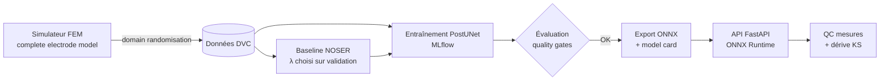

# PulmoEIT — imagerie pulmonaire portable par tomographie d'impédance électrique et MLOps

[](https://github.com/sheene123/pulmoeit/actions/workflows/ci.yml)

Reconstruction d'images de ventilation pulmonaire par apprentissage profond pour des
ceintures **EIT** (*Electrical Impedance Tomography*) portables, avec une chaîne **MLOps**
complète : données versionnées, expériences tracées, *quality gates*, export embarqué
ONNX, API d'inférence, contrôle qualité des mesures et détection de dérive.

> Prototype de recherche. Ce n'est pas un dispositif médical.

## Pourquoi l'EIT ?

L'EIT injecte de faibles courants alternatifs par une ceinture de 16 électrodes et mesure
les tensions en surface. On en reconstruit, jusqu'à 50 fois par seconde, la carte de
ventilation régionale des poumons. L'appareil tient dans un sac, ne produit aucune
radiation et coûte une fraction d'un scanner : c'est l'un des rares outils capables de
**suivre la ventilation au lit du patient en continu** (réanimation, ventilation
mécanique, SDRA, pneumothorax).

Le revers de la médaille :

- le problème inverse est **sévèrement mal posé**, d'où des images floues avec les
  algorithmes linéaires embarqués dans les moniteurs (GREIT, NOSER) ;
- les images sont **sensibles à la forme du thorax et à la position de la ceinture**,
  qu'on ne connaît jamais exactement ;
- **aucune vérité terrain in vivo** n'est disponible, ce qui force à apprendre sur des
  simulations et pose le problème du passage *sim-to-real* ;
- une électrode qui se décolle produit des images fausses mais plausibles.

Ce dépôt attaque ces quatre points avec une approche **physique + apprentissage + MLOps**.
Le sujet de recherche sous-jacent est détaillé dans [docs/these.md](docs/these.md).

## Ce que contient le projet



| Brique | Détail |
|---|---|
| **Simulation physique** | FEM P1 du *complete electrode model* (impédance de contact, électrodes étendues), jacobien par méthode adjointe, validé par réciprocité et différences finies ([fem.py](src/pulmoeit/fem.py)) |
| **Fantômes thoraciques** | poumons, cœur, rachis ; 5 scénarios : sain, atélectasie dorsale (SDRA), intubation sélective, pneumothorax, épanchement pleural ([phantom.py](src/pulmoeit/phantom.py)) |
| **Domain randomisation** | forme du thorax, position des électrodes, impédances de contact, bruit ; maillage de simulation plus fin que celui de reconstruction (pas de *crime inverse*) ([dataset.py](src/pulmoeit/dataset.py)) |
| **Baseline** | reconstruction linéaire en un pas avec a priori NOSER, λ sélectionné sur validation ([recon.py](src/pulmoeit/recon.py)) |
| **Modèles** | `PostUNet` (NOSER + U-Net résiduel, la physique reste dans la boucle) et `DirectNet` (inverse entièrement appris) ([models.py](src/pulmoeit/models.py)) |
| **Indices cliniques** | index d'inhomogénéité globale (GI), centre de ventilation (CoV), distribution régionale par quadrant, selon le consensus TREND ([metrics.py](src/pulmoeit/metrics.py)) |
| **Surveillance** | score de plausibilité des mesures (résidu PCA), localisation de l'électrode fautive, test de dérive Kolmogorov-Smirnov ([monitoring.py](src/pulmoeit/monitoring.py)) |
| **MLOps** | pipeline DVC, suivi MLflow, *quality gates* bloquantes, export ONNX avec test de parité, *model card* générée, CI GitHub Actions, image Docker sans PyTorch |

## Démarrage rapide

```bash
python -m venv .venv && source .venv/bin/activate
pip install torch --index-url https://download.pytorch.org/whl/cpu   # ou la roue CUDA de votre GPU
pip install -e ".[dev]"

dvc repro                 # génération -> baseline -> entraînement -> évaluation -> export
mlflow ui --backend-store-uri sqlite:///mlflow.db   # suivi des expériences
pulmoeit serve            # API sur http://127.0.0.1:8000/docs
pytest                    # tests unitaires, physiques et API
```

Chaque étape peut aussi être lancée seule (`pulmoeit generate|baseline|train|evaluate|export`),
éventuellement avec une autre configuration : `pulmoeit --params configs/params.smoke.yaml train`.

### API

```bash
docker build -t pulmoeit .          # après `dvc repro` (le modèle est copié dans l'image)
docker run -p 8000:8000 pulmoeit
```

| Route | Rôle |
|---|---|
| `POST /v1/reconstruct` | deux trames de 208 tensions (fin d'expiration, fin d'inspiration) → image 32×32, GI, CoV, distribution régionale, verdict QC et électrode suspecte |
| `GET /v1/monitoring/drift` | test KS des scores QC récents contre la référence de calibration |
| `GET /v1/model` | *model card* : version, empreinte ONNX, métriques, limites connues |
| `GET /health` | sonde de vie |

## Résultats

Les métriques de la dernière exécution du pipeline sont versionnées dans
[reports/report.md](reports/report.md) et [reports/metrics.json](reports/metrics.json)
(`dvc metrics show`, `dvc metrics diff` pour comparer deux expériences).

## Organisation

```
src/pulmoeit/     simulateur, reconstruction, modèles, évaluation, monitoring, API
tests/            tests physiques (réciprocité, jacobien, symétries), métriques, API
params.yaml       tous les hyperparamètres du pipeline (suivis par DVC)
dvc.yaml          définition du pipeline
configs/          configuration « smoke » utilisée par la CI
docs/these.md     proposition de sujet de thèse
```

## Feuille de route

- [x] Simulateur CEM validé, fantômes pathologiques, domain randomisation
- [x] Baseline NOSER, PostUNet, indices cliniques
- [x] Pipeline DVC + MLflow, quality gates, ONNX, API, QC et dérive, CI
- [ ] Validation sur données réelles de cuve ouvertes (Kuopio / KTC2023)
- [ ] Incertitude calibrée (ensembles profonds, prédiction conforme)
- [ ] Géométrie 3D et ceintures à 32 électrodes
- [ ] Quantification INT8 et mesure de latence sur microcontrôleur / SoC
- [ ] Plan de changement prédéterminé (PCCP) et dossier de traçabilité IEC 62304

## Licence

MIT
