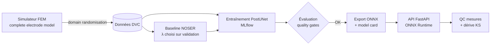
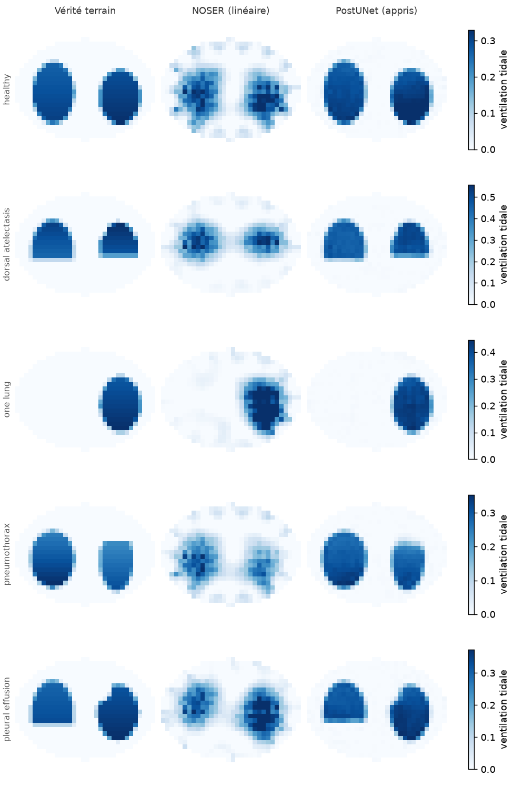
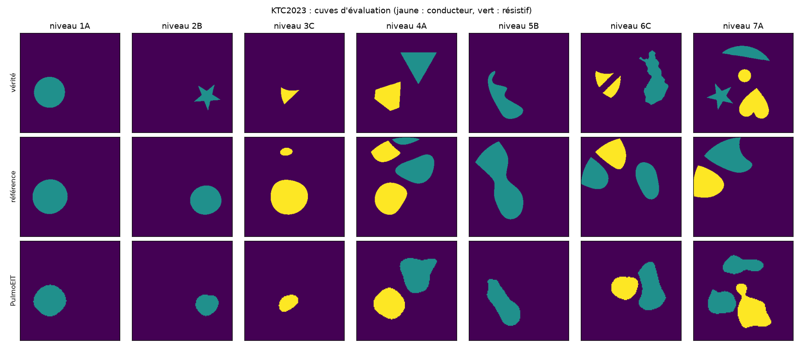

# PulmoEIT — imagerie pulmonaire portable par tomographie d'impédance électrique et MLOps

[](https://github.com/sheene123/pulmoeit/actions/workflows/ci.yml)
[](https://github.com/sheene123/pulmoeit/actions/workflows/deploiement.yml)
[](https://huggingface.co/sheenee261/pulmoeit)
[](https://huggingface.co/spaces/sheenee261/pulmoeit)

**Démo en ligne : https://huggingface.co/spaces/sheenee261/pulmoeit** (tout s'exécute dans le navigateur).

Reconstruction d'images de ventilation pulmonaire par apprentissage profond pour des
ceintures **EIT** (*Electrical Impedance Tomography*) portables, avec une chaîne **MLOps**
complète : données versionnées, expériences tracées, *quality gates*, export embarqué
ONNX, API d'inférence, contrôle qualité des mesures et détection de dérive.

> Prototype de recherche. Ce n'est pas un dispositif médical.

## Démo interactive

[Essayer en ligne](https://huggingface.co/spaces/sheenee261/pulmoeit) :
- choisir une situation clinique (poumons sains, SDRA, intubation sélective, pneumothorax, épanchement pleural) ;
- comparer la vérité terrain, la reconstruction linéaire NOSER et le PostUNet, avec les indices cliniques ;
- dégrader les conditions (bruit, ceinture décalée, thorax irrégulier), décoller une électrode et voir le
  contrôle qualité réagir ;
- charger ses propres mesures (CSV `v_ref,v_insp`, 208 tensions).

La page ([demo/web/](demo/web/)) exécute le simulateur, NOSER et le contrôle qualité en Python dans le
navigateur ([Pyodide](https://pyodide.org)), et le réseau avec ONNX Runtime Web, à partir du **même fichier
ONNX** que l'API. Publication : `python scripts/deployer_space.py --space <utilisateur>/pulmoeit` après
`dvc repro`.

## Pourquoi l'EIT ?

L'EIT injecte de faibles courants alternatifs par une ceinture de 16 électrodes et mesure
les tensions en surface. On en reconstruit, jusqu'à 50 fois par seconde, la carte de
ventilation régionale des poumons. L'appareil tient dans un sac, ne produit aucune
radiation et coûte une fraction d'un scanner : c'est l'un des rares outils capables de
**suivre la ventilation au lit du patient en continu** (réanimation, ventilation
mécanique, SDRA, pneumothorax).

Le revers de la médaille :

- le problème inverse est **sévèrement mal posé**, d'où des images floues avec les
  algorithmes linéaires embarqués dans les moniteurs (GREIT, NOSER) ;
- les images sont **sensibles à la forme du thorax et à la position de la ceinture**,
  qu'on ne connaît jamais exactement ;
- **aucune vérité terrain in vivo** n'est disponible, ce qui force à apprendre sur des
  simulations et pose le problème du passage *sim-to-real* ;
- une électrode qui se décolle produit des images fausses mais plausibles.

Ce dépôt attaque ces quatre points avec une approche **physique + apprentissage + MLOps**.

## Ce que contient le projet



| Brique | Détail |
|---|---|
| **Simulation physique** | FEM P1 du *complete electrode model* (impédance de contact, électrodes étendues), jacobien par méthode adjointe, validé par réciprocité et différences finies ([fem.py](src/pulmoeit/fem.py)) |
| **Fantômes thoraciques** | poumons, cœur, rachis ; 5 scénarios : sain, atélectasie dorsale (SDRA), intubation sélective, pneumothorax, épanchement pleural ([phantom.py](src/pulmoeit/phantom.py)) |
| **Domain randomisation** | forme du thorax, position des électrodes, impédances de contact, bruit ; maillage de simulation plus fin que celui de reconstruction (pas de *crime inverse*) ([dataset.py](src/pulmoeit/dataset.py)) |
| **Baseline** | reconstruction linéaire en un pas avec a priori NOSER, λ sélectionné sur validation ([recon.py](src/pulmoeit/recon.py)) |
| **Modèles** | `PostUNet` (NOSER + U-Net résiduel, la physique reste dans la boucle) et `DirectNet` (inverse entièrement appris) ([models.py](src/pulmoeit/models.py)) |
| **Indices cliniques** | index d'inhomogénéité globale (GI), centre de ventilation (CoV), distribution régionale par quadrant, selon le consensus TREND ([metrics.py](src/pulmoeit/metrics.py)) |
| **Surveillance** | score de plausibilité des mesures (résidu PCA), localisation de l'électrode fautive, test de dérive Kolmogorov-Smirnov ([monitoring.py](src/pulmoeit/monitoring.py)) |
| **MLOps** | pipeline DVC, suivi MLflow, *quality gates* bloquantes, export ONNX avec test de parité, *model card* générée, CI GitHub Actions, image Docker sans PyTorch |

## Déploiement continu

Une version se publie avec un tag Git (`git tag v0.2.0 && git push origin v0.2.0`). Le modèle est
alors **réentraîné en CI** à partir du code et des paramètres versionnés, soumis aux quality
gates, puis **comparé au modèle en production** (champion / challenger). S'il ne régresse pas, il
est publié dans le **registre de modèles** ([Hugging Face Hub](https://huggingface.co/sheenee261/pulmoeit),
une étiquette par version), l'image Docker est poussée sur GHCR, la démo est mise à jour et une
release GitHub est créée avec le rapport. Détails : [docs/deploiement.md](docs/deploiement.md).

## Démarrage rapide

```bash
python -m venv .venv && source .venv/bin/activate
pip install torch --index-url https://download.pytorch.org/whl/cpu     # CPU
# pip install torch --index-url https://download.pytorch.org/whl/cu130  # GPU NVIDIA (RTX 50xx inclus)
pip install -e ".[dev]"

dvc repro                 # génération -> baseline -> entraînement -> évaluation -> export
mlflow ui --backend-store-uri sqlite:///mlflow.db   # suivi des expériences
pulmoeit serve            # API sur http://127.0.0.1:8000/docs
pytest                    # tests unitaires, physiques et API
```

L'entraînement utilise automatiquement le GPU s'il est disponible (`train.device` dans
[params.yaml](params.yaml) pour forcer `cpu` ou `cuda`). La simulation par éléments finis,
elle, tourne sur CPU en parallèle (un processus par cœur, BLAS mono-thread).

Chaque étape peut aussi être lancée seule (`pulmoeit generate|baseline|train|evaluate|export`),
éventuellement avec une autre configuration : `pulmoeit --params configs/params.smoke.yaml train`.

### API

```bash
docker build -t pulmoeit .          # après `dvc repro` (le modèle est copié dans l'image)
docker run -p 8000:8000 pulmoeit
```

| Route | Rôle |
|---|---|
| `POST /v1/reconstruct` | deux trames de 208 tensions (fin d'expiration, fin d'inspiration) → image 32×32, GI, CoV, distribution régionale, verdict QC et électrode suspecte |
| `GET /v1/monitoring/drift` | test KS des scores QC récents contre la référence de calibration |
| `GET /v1/model` | *model card* : version, empreinte ONNX, métriques, limites connues |
| `GET /health` | sonde de vie |

## Résultats (simulation)

Dernière exécution de `dvc repro` : 6 000 exemples d'entraînement, PostUNet de 117 k
paramètres entraîné en 42 s sur un GPU RTX 5070 portable. Rapport complet :
[reports/report.md](reports/report.md), métriques brutes : [reports/metrics.json](reports/metrics.json).

| Jeu de test | Méthode | Corrélation ↑ | Erreur GI ↓ | Erreur CoV (pts %) ↓ | Erreur régionale (pts %) ↓ |
|---|---|---|---|---|---|
| même distribution | NOSER (linéaire) | 0,847 | 0,158 | 0,64 | 2,12 |
| même distribution | **PostUNet** | **0,990** | **0,017** | **0,25** | **0,76** |
| décalé (thorax, ceinture, bruit) | NOSER (linéaire) | 0,765 | 0,154 | 1,16 | 3,57 |
| décalé (thorax, ceinture, bruit) | **PostUNet** | **0,938** | **0,038** | **0,74** | **2,19** |

Contrôle qualité des mesures : une électrode décollée est détectée dans 100 % des cas
pour 0,6 % de fausses alarmes, et l'électrode fautive est localisée dans 99,8 % des cas.
Le test de dérive se déclenche sur le jeu décalé et reste silencieux sur le jeu de même
distribution.



> **À lire avec prudence.** Ces chiffres sont obtenus en simulation, avec des fantômes
> issus du même générateur paramétrique que l'entraînement. Ils valident la chaîne et
> montrent l'apport de l'apprentissage face à la baseline linéaire, mais pas les
> performances sur patient : voir le premier test sur données réelles ci-dessous.

## Benchmark public KTC2023 : vraies mesures, vérité terrain

Sur le [Kuopio Tomography Challenge 2023](https://fips.fi/data-challenges/kuopio-tomography-challenge-2023/)
(cuve d'eau réelle, 32 électrodes, vérité terrain segmentée, score officiel), la même approche que
PulmoEIT (reconstruction linéaire physique, puis U-Net entraîné sur 15 000 cuves simulées avec le
simulateur officiel) obtient **14,93 sur 21**, contre 10,30 pour la méthode de référence des
organisateurs : mieux sur les 21 cuves. Les algorithmes publiés vont de 12,38 à 15,24 (1er).
Comparaison faite après le défi, pas en aveugle ([docs/ktc2023.md](docs/ktc2023.md)).
Modèle publié : [sheenee261/pulmoeit-ktc2023](https://huggingface.co/sheenee261/pulmoeit-ktc2023) ; démo :
[page KTC2023 du Space](https://huggingface.co/spaces/sheenee261/pulmoeit/blob/main/ktc.html), où le réseau tourne dans le navigateur.

| Méthode | Score sur 21 |
|---|---|
| Bremen, 1er du défi | 15,24 |
| **PulmoEIT** | **14,93** |
| Team ABC / Team DTU | 12,76 / 12,38 |
| Référence des organisateurs | 10,30 |



## Premier test sur des mesures réelles

Un enregistrement public d'EIDORS, celui d'un nouveau-né en respiration spontanée (appareil
Goe-MF II, 16 électrodes, protocole adjacent), passe dans la même chaîne après conversion de ses
conventions ([docs/donnees_reelles.md](docs/donnees_reelles.md)). Sans vérité terrain, quatre
vérifications ont été fixées à l'avance :

| Vérification | NOSER | PostUNet |
|---|---|---|
| Ventilation dans la bande centrale (23 % du thorax) | 30 % | **15 %** |
| Reproductibilité entre respirations | 0,94 | 0,91 |
| Répartition droite / gauche | 64 / 36 % | **88 / 12 %** |
| Mesures rejetées par le contrôle qualité | | **100 %** |

Le réseau reste stable et place mieux la ventilation sur les côtés, mais il **exagère fortement
l'asymétrie**, peut-être en se rabattant sur un scénario simulé (intubation sélective). Le
**contrôle qualité rejette toutes les mesures réelles** : appris en simulation, il ne distingue
pas une électrode décollée du passage au réel. Le patient sort aussi du domaine simulé (thorax de
nouveau-né, couché sur le ventre). L'écart simulation → réel est donc réel et mesuré ; le
réduire est la suite du projet.

Comparer deux expériences : `dvc metrics diff`, `dvc exp run -S train.lr=1e-3`, ou l'interface MLflow.

## Organisation

```
src/pulmoeit/     simulateur, reconstruction, modèles, évaluation, monitoring, API
tests/            tests physiques (réciprocité, jacobien, symétries), métriques, API
params.yaml       tous les hyperparamètres du pipeline (suivis par DVC)
dvc.yaml          définition du pipeline
configs/          configuration « smoke » utilisée par la CI
demo/web/         démo dans le navigateur (Pyodide + ONNX Runtime Web)
scripts/          publication de la démo, test sur données réelles (EIDORS)
```

## Feuille de route

- [x] Simulateur CEM validé, fantômes pathologiques, domain randomisation
- [x] Baseline NOSER, PostUNet, indices cliniques
- [x] Pipeline DVC + MLflow, quality gates, ONNX, API, QC et dérive, CI
- [x] Premier test sur données réelles : nouveau-né (EIDORS), écart simulation → réel mesuré ([docs/donnees_reelles.md](docs/donnees_reelles.md))
- [x] Benchmark public KTC2023 (cuve réelle, vérité terrain) : 14,93 sur 21, référence 10,30 ([docs/ktc2023.md](docs/ktc2023.md))
- [ ] Simulation élargie (thorax de nouveau-né, décubitus ventral) et contrôle qualité recalibré sur mesures réelles
- [ ] Incertitude calibrée (ensembles profonds, prédiction conforme)
- [ ] Géométrie 3D et ceintures à 32 électrodes
- [ ] Quantification INT8 et mesure de latence sur microcontrôleur / SoC
- [x] Déploiement continu : registre de modèles versionné, champion / challenger, image GHCR, démo, release
- [ ] Plan de changement prédéterminé (PCCP) et dossier de traçabilité IEC 62304

## Licence

MIT
