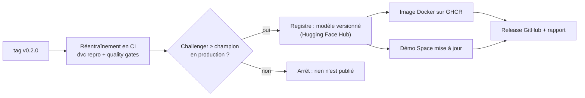

# Déploiement continu

Une version se publie en créant un tag Git. Tout le reste est automatique
([.github/workflows/deploiement.yml](../.github/workflows/deploiement.yml)).

```bash
git tag v0.2.0 && git push origin v0.2.0
```



| Étape | Ce qui se passe | Ce qui peut l'arrêter |
|---|---|---|
| Réentraînement | `dvc repro --force` sur un runner GitHub : génération des données, baseline, entraînement, évaluation, export ONNX. Le modèle est reconstruit à partir du code et de `params.yaml` versionnés, pas copié depuis un poste. | une *quality gate* en échec (`evaluate --enforce-gates`) |
| Registre | [scripts/publier_modele.py](../scripts/publier_modele.py) compare le nouveau modèle (*challenger*) à la dernière version publiée (*champion*) sur trois indicateurs : corrélation en test, corrélation en conditions décalées, AUC de détection d'électrode décollée. Il publie sur le [Hub](https://huggingface.co/sheenee261/pulmoeit) avec l'étiquette de version et une fiche modèle. | une régression au-delà des tolérances (0,01 ; 0,02 ; 0,01) |
| Image Docker | construite avec le modèle, testée (`/health`), poussée sur `ghcr.io/sheene123/pulmoeit:<version>` et `:latest` | l'API ne démarre pas |
| Démo | le Space est republié avec le nouveau modèle ONNX | |
| Release | release GitHub avec le rapport d'évaluation, la fiche modèle et les métriques | |

Le job du registre tourne dans l'environnement GitHub `production`. On peut y ajouter une
validation manuelle (Settings, Environments, production, *Required reviewers*) pour qu'une
personne approuve chaque mise en production.

## Revenir à une version

Chaque version reste disponible, avec ses métriques, sous son étiquette :

```bash
hf download sheenee261/pulmoeit --revision v0.1.0 --local-dir models/
docker run -p 8000:8000 ghcr.io/sheene123/pulmoeit:v0.1.0
```

## Mise en place (une fois)

Le secret `HF_TOKEN` (jeton Hugging Face avec droit d'écriture) doit être ajouté à
l'environnement `production` du dépôt GitHub :

```bash
gh secret set HF_TOKEN --env production --repo sheene123/pulmoeit < ~/.cache/huggingface/token
```
