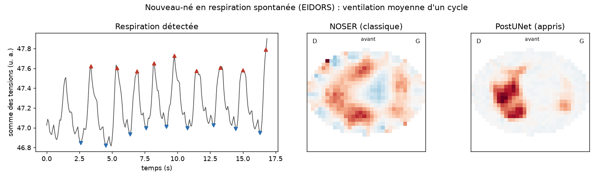

# Premier test sur des mesures réelles : un nouveau-né

Jusqu'ici, PulmoEIT n'était évalué qu'en simulation, sur des fantômes issus du même générateur
que l'entraînement. Ce document le confronte à un enregistrement réel. Bilan : la reconstruction
apprise reste stable et place la ventilation plutôt sur les côtés, mais elle exagère fortement
l'asymétrie entre les deux poumons, et le contrôle qualité rejette toutes les mesures réelles.

Script : [evaluer_donnees_reelles.py](../scripts/evaluer_donnees_reelles.py) ; résultats :
[donnees_reelles.json](../reports/donnees_reelles.json).

## Données

Jeu « if-neonate-spontaneous » d'[EIDORS](https://eidors3d.sourceforge.net/data_contrib/if-neonate-spontaneous/)
(I. Frerichs ; Heinrich et al., *Intensive Care Medicine* 32:1392-1398, 2006). Nouveau-né de
10 jours en respiration spontanée, couché sur le ventre, tête tournée à gauche. Appareil
Goe-MF II, 16 électrodes, protocole adjacent, 13 images par seconde, 220 images (17 s).

Le format correspond à celui du simulateur : 208 mesures par image (16 injections × 13). Trois
conventions diffèrent et sont converties :

| Convention | Appareil | Simulateur | Vérification |
|---|---|---|---|
| Ordre des mesures d'une injection | à partir de la paire qui suit l'injection | par numéro d'électrode | profil des tensions réelles et simulées corrélé à 0,88 après conversion, 0,07 sans |
| Sens de numérotation | électrode 1 devant, 5 à gauche du patient | électrode 0 devant, numérotation vers la droite du patient | documentation du jeu de données seulement : le profil, presque symétrique, ne permet pas de le vérifier |
| Signe | amplitudes positives | tensions négatives | — |

## Ce qui était vérifié, et le résultat

Il n'y a pas de vérité terrain chez un patient. Quatre vérifications ont été fixées avant de
regarder les images. Neuf respirations sont détectées, soit 35 par minute, une fréquence normale
pour un nouveau-né.

| Vérification | NOSER (classique) | PostUNet (appris) | Verdict |
|---|---|---|---|
| Ventilation dans la bande centrale (cœur, médiastin), qui couvre 23 % du thorax | 30 % | 15 % | le réseau place mieux la ventilation sur les côtés |
| Reproductibilité entre deux respirations (corrélation) | 0,94 | 0,91 | stable |
| Répartition droite / gauche du patient | 64 % / 36 % | **88 % / 12 %** | asymétrie fortement exagérée par le réseau |
| Accord entre les deux méthodes (corrélation des images moyennes) | — | 0,55 | moyen |
| Mesures rejetées par le contrôle qualité | — | **100 %** (score médian 10 fois le seuil) | inutilisable en l'état sur données réelles |

## Ce qu'on en apprend

- **Le réseau a appris des formes de poumons, et il les impose.** Une forte asymétrie peut être
  réelle : la position de la tête change la répartition de la ventilation chez le nourrisson
  (c'est l'objet de l'étude d'origine). Mais 88 / 12, contre 64 / 36 pour la méthode classique,
  ressemble à l'un des scénarios d'entraînement, l'intubation sélective, où un seul poumon
  ventile. Hypothèse non vérifiée : sur des mesures hors de sa distribution, le réseau se
  rabat vers le scénario simulé le plus proche.
- **Le contrôle qualité ne distingue pas « électrode décollée » et « vraie personne ».** Appris
  sur des simulations, il juge toutes les mesures réelles anormales, et désigne l'électrode
  avant comme suspecte. Il a raison de signaler un changement de distribution (le test de dérive
  se déclenche aussi), mais il doit être recalibré sur des mesures réelles pour être utile.
- **Le patient sort du domaine d'entraînement.** Le simulateur génère des thorax d'adulte
  (rapport antéro-postérieur / largeur de 0,64 à 0,80) ; un nouveau-né a un thorax plus rond,
  des électrodes proportionnellement plus grandes, et il est couché sur le ventre.

## Suite

1. **Cuve d'eau avec cibles connues** : la base ouverte de Kuopio (16 électrodes, protocole
   adjacent, photos des cibles) permettrait de mesurer l'erreur de localisation, avec une
   vérité terrain.
2. **Élargir la simulation** : thorax plus ronds (nouveau-nés), position couchée sur le ventre,
   électrodes plus larges ; puis refaire ce test.
3. **Recalibrer le contrôle qualité** sur des mesures réelles saines, pour qu'il signale les
   électrodes défaillantes et non le simple passage au réel.
